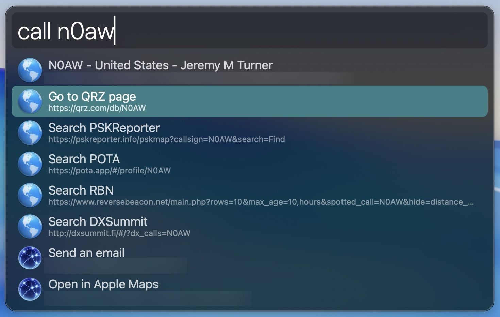

# QRZ Ham Radio Callsign Lookup

An Alfred workflow for looking up amateur radio callsigns via QRZ.

## Usage

### First-time setup

Run `qrzset <credentials>` once to store your QRZ credentials. This only needs to be done once.

### Looking up a callsign

Type `call <callsign>` to look up any amateur radio callsign. Results appear within seconds and link to commonly viewed pages across ham radio sites.

## Requirements

- [Alfred](https://www.alfredapp.com/) with Powerpack
- Python 3
- A QRZ account

## License

Licensed under [CC BY-NC-SA 4.0](https://creativecommons.org/licenses/by-nc-sa/4.0/) — Attribution-NonCommercial-ShareAlike 4.0 International.
